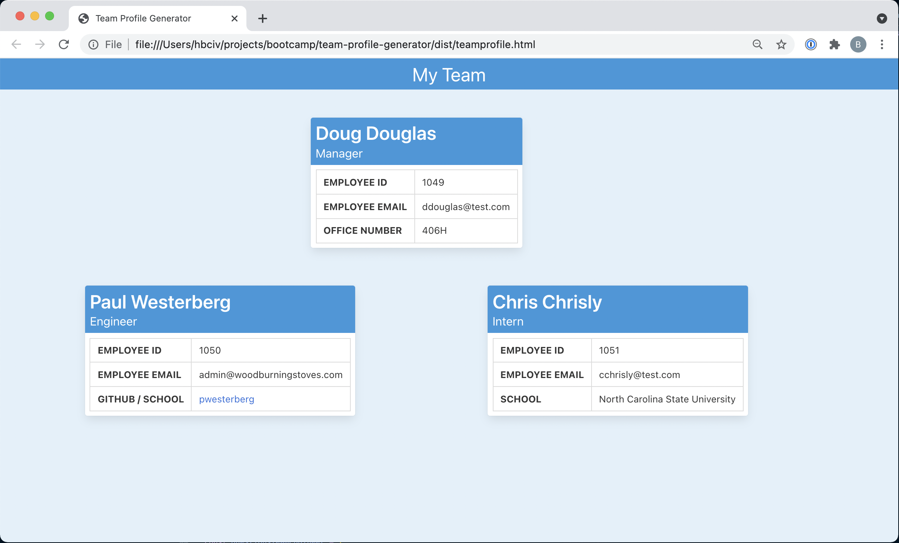

# Team Profile Generator

## Description

As development teams grow it may become useful to maintain dev employee information in a single, highly accessible location.  It may even more useful to minimize application dependecies--such as Excel, Google Calendars, etc.--if the team information were app agnostic and made accessible through a simple HTML file.

The Team Profile Generator aims to satisfy both of these requirements using a simple command line Node.js application.  Through the CLI users will enter basic team member information (name, email, etc.) and the generator will return a fully styled, directory page for each employee.

The application design will require implementing Javascript's object oriented programmings methods to create an "Employee" parent class and then developing sub-classes, such as "Manager," and "Intern," to accomodate different roles for team members added to the profile.

#### Technologies Used

* [Node.js](https://nodejs.org/en/about/)
* [Inquirer](https://github.com/SBoudrias/Inquirer.js)
* [fs](https://nodejs.org/api/fs.html)
* [jest](https://jestjs.io/)
* [Bulma](https://bulma.io/)


## Installation

1. [Fork the repository](https://github.com/monstertruckdog/team-profile-generator) to a local directory
2. In your terminal, navigate to the repository directory and execute the following command:

 ```
 npm i
 ```
3. Once installation is completed, execute the following command in the terminal:

 ```
  node index.js
```

4. Follow the prompts in the application
5. Once the application has generated the file navigate to the `/output` folder in the directory
6. Open the file `teamprofile.html` in any web browser

## Usage

#### Creating new Team Profile and adding employees


#### Team Profile page output display



## Testing

Unit tests using [Jest](https://jestjs.io/) have been included for each of the employee classes used in the profile generation.

#### Test Exeuction

1. In the command line, navigate to the repository directory
2. Execute the following command:

    ```
    npm run test
    ```
    
    * For verbose output excute the following:
    
    ```
    npm run test -- --verbose
    ```
3. Test results are populated in the command line

#### Test Usage:  Test Execution


## Future Enhancements

* Improve display of command line prompts using [Inquirer](https://github.com/SBoudrias/Inquirer.js)
	* Implement color in prompts and responses using [Chalk](https://github.com/chalk/chalk)
* Allow user to define Team Name that appears at the top of the page
* Allow user to update Team Member information
* Implement option to export of page to pdf
* Include footer element with information regarding when the profile page was generated

### Contact

* GitHub:  [link](https://github.com/monstertruckdog/readme-generator)
* Email:  *see GitHub page*


    